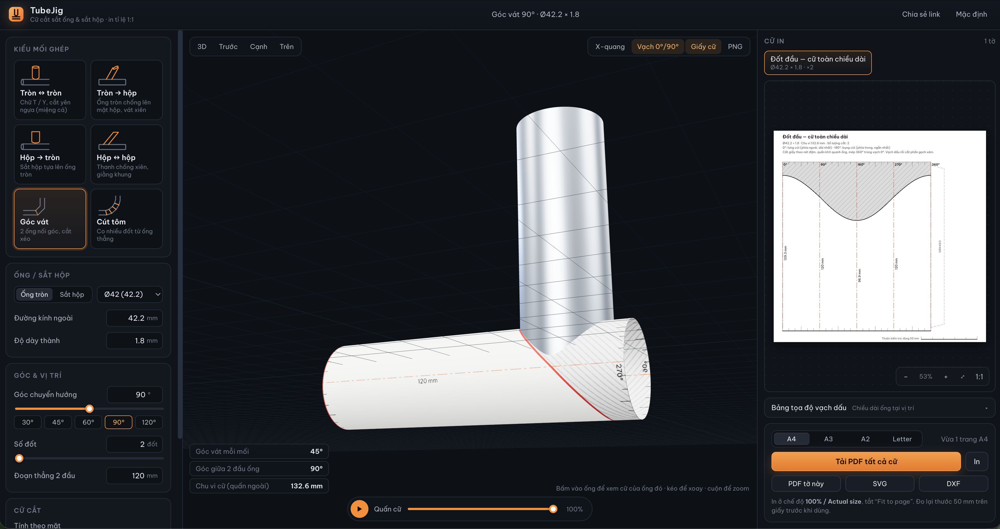

# TubeJig — Cữ cắt sắt ống & sắt hộp

Công cụ web mô phỏng 3D các mối ghép sắt ống tròn và sắt hộp ở nhiều góc khác nhau. App tính đường cắt, rồi xuất **cữ giấy in đúng tỉ lệ 1:1**. Quấn cữ quanh ống, vạch theo nét là cắt được, không cần tính tay.

**Dùng thử:** https://minh-cdh.github.io/tubejig/



Mình làm DIY, không phải thợ hàn chuyên nghiệp. Cắt ghép sắt ống, nhất là ống tròn, ở góc 45° hay chữ T thì đo vạch bằng tay rất dễ lệch, ghép vào hở một bên là coi như bỏ đoạn ống. Vì vậy mình làm công cụ này: chọn kiểu ghép, nhập kích thước, xem mô phỏng 3D cho chắc, rồi in cữ ra giấy quấn lên ống là vạch cắt được.

## Tính năng

### Kiểu mối ghép

| Kiểu | Dùng cho |
| --- | --- |
| Tròn ↔ tròn | Chữ T, chữ Y, cắt yên ngựa (miệng cá), có lệch tâm |
| Tròn → hộp | Ống tròn chống xiên lên mặt sắt hộp |
| Hộp → tròn | Sắt hộp tựa lên ống tròn |
| Hộp ↔ hộp | Thanh chống xiên, giằng khung |
| Góc vát | 2 ống nối góc, cắt xéo (vuông góc hoặc góc bất kỳ) |
| Cút tôm | Co nhiều đốt ghép từ ống thẳng, chọn số đốt và bán kính uốn |

- Góc giữa 2 trục ống chỉnh được từ 15° đến 90°. Góc chuyển hướng của cút chỉnh được từ 1° đến 179°.
- Có sẵn quy cách ống tròn và sắt hộp thông dụng ở Việt Nam (Ø21, Ø27, Ø34, Ø42, Ø49, Ø60…; hộp 20×20, 30×30, 30×60, 40×80…). Cũng nhập tay được kích thước, độ dày thành và bo góc.
- Có 4 cách tính đường cắt:
  - **Không cấn** (mặc định): lấy chỗ ăn sâu nhất qua bề dày thành. Ống ghép vào không bị cấn và để lại khe V để hàn.
  - **Mặt ngoài / Giữa thành / Mặt trong**: tính theo đúng một mặt của thành ống.

### Mô phỏng 3D

- Ống được dựng đúng theo đường cắt đã tính, có bề dày thành và mặt cắt.
- Xoay, zoom, và xem theo các hướng: 3D, trước, cạnh, trên.
- Bấm vào ống nào thì bảng bên phải hiện cữ của ống đó.
- **Quấn cữ**: xem tờ giấy cữ cuộn lên ống để biết cách dán và vị trí các vạch.
- Chế độ X-quang, và vạch dấu 0° (đỏ) / 90° (cam) hiển thị trên ống.
- Xuất ảnh PNG của mô hình.

### Cữ in

- **PDF tỉ lệ 1:1** có font tiếng Việt. Cữ lớn hơn khổ giấy tự chia sang nhiều trang A4/A3/A2/Letter, chồng mép 10 mm và có dấu chữ thập để ghép.
- Trên cữ có vạch chia độ, đường gấp ở góc sắt hộp, mép dán keo, và phần bỏ tô gạch xám.
- Mỗi trang có thước kiểm tra 20 mm, mỗi cữ có thước 50 mm.
- Ống dài được tách cữ riêng cho từng đầu cắt, kèm **đường chuẩn** vuông góc trục ống và khoảng cách giữa hai đầu.
- Cữ **khoét lỗ** trên ống chính (tùy chọn).
- **Bảng tọa độ vạch dấu** để vạch bằng tay khi không in được.
- Xuất thêm **SVG** và **DXF** (cho CAD, máy cắt laser hoặc plasma).
- **Chia sẻ link**: toàn bộ thông số nằm trong URL. Trình duyệt tự nhớ cấu hình lần trước.

## Cách dùng cữ

1. Chọn kiểu mối ghép. **Đo đường kính ngoài thật** của ống bằng thước kẹp rồi nhập vào, đừng chọn theo tên quy cách, vì ống thực tế thường lệch vài phần mười mm.
2. Chỉnh góc, lệch tâm và chiều dài. Kiểm tra lại mô hình 3D.
3. Bấm **Tải PDF tất cả cữ**.
4. In ở chế độ **100% / Actual size** và **tắt "Fit to page"**.
5. Lấy thước đo vạch 50 mm trên giấy. Nếu không đúng 50 mm thì chỉnh lại máy in, đừng dùng tờ đó.
6. Cắt giấy theo khung. Quấn khít quanh ống sao cho mép 360° trùng vạch 0°, và mép giấy vuông góc với trục ống. Dán băng keo.
7. Vạch dấu theo nét đậm, rồi cắt về phía phần gạch xám. Chừa đường vạch lại rồi mài chỉnh.
8. Nên cắt thử 1 mối trên ống vụn trước khi cắt hàng loạt.

### Sai số cần biết

- Máy in tự co giãn là nguyên nhân sai phổ biến nhất. Luôn đo lại thước 50 mm.
- Giấy có độ dày, nên khi quấn mép 360° có thể hụt khoảng 0.5 mm so với vạch 0°. Mức này bình thường.
- Mạch cắt của lưỡi mài hoặc máy cắt plasma rộng 1–2 mm.

## Phát triển

Cần Node.js 20 trở lên.

```bash
npm install
npm run dev      # chạy local ở http://localhost:5173
npm test         # test hình học (vitest)
npm run build    # build ra thư mục dist/
npm run deploy   # build và đẩy lên GitHub Pages (nhánh gh-pages)
```

### Công nghệ

- Vue 3 + TypeScript + Vite
- Three.js: mô phỏng 3D
- jsPDF: xuất PDF vector tỉ lệ 1:1, nhúng font Be Vietnam Pro

### Cấu trúc thư mục

```
src/
  core/        # tính toán hình học (không phụ thuộc giao diện)
    profile.ts   # biên dạng ống tròn / sắt hộp, chu vi, vạch góc
    joint.ts     # mối ghép: yên ngựa, cắt vát, cút tôm, lỗ khoét
    template.ts  # dựng cữ in (nét cắt, vạch, đường chuẩn, bảng tọa độ)
    presets.ts   # quy cách ống và mẫu mối ghép
  render/      # xuất ra các định dạng
    scene.ts     # scene Three.js
    pdf.ts       # PDF chia trang, nhúng font
    svg.ts, dxf.ts, canvas.ts
  components/  # giao diện Vue
tests/         # test hình học
```

### Nguyên lý tính

Mỗi ống được mô tả bằng biên dạng mặt cắt (tròn hoặc hộp bo góc) và hai hàm cắt ở hai đầu, theo hệ trục riêng của ống. Với mỗi điểm trên chu vi, app tính độ cao z mà tại đó ống chạm mặt ống chính (mặt trụ hoặc mặt phẳng) hoặc chạm mặt phẳng cắt vát. Trải chu vi ra thành trục ngang và lấy z làm trục dọc là được cữ. Test kiểm tra rằng mọi điểm trên đường cắt nằm đúng trên mặt ống chính, và khớp với công thức tay ở các trường hợp đã biết (góc vát 45°, cắt xiên lên mặt phẳng, cút tôm).
